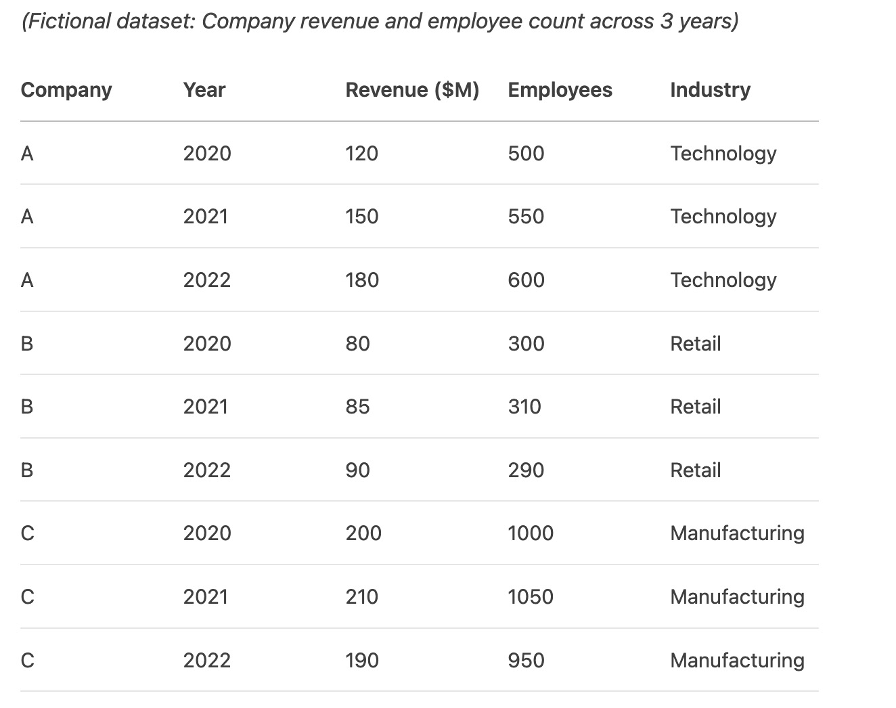
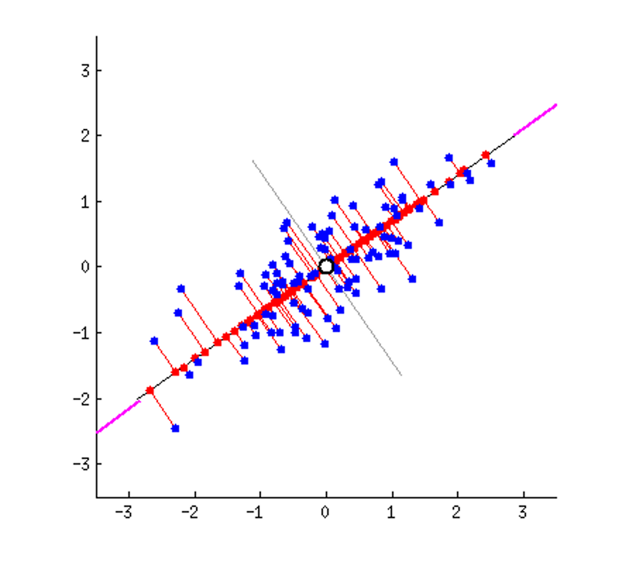

# Big Data Analysis 2025

An English-language teaching repository for applied data analysis with World Development Indicators, China regional data, regression, PCA, financial data, and geographic mapping.

This repository is designed for course delivery, self-study, and public teaching demos. It keeps the lecture-homework structure clear, uses repository-relative paths, and includes lighter teaching datasets for easier sharing on GitHub.

## Course Highlights

- Seven teaching modules from data cleaning to mapping and portfolio analysis
- Separate `lectures/` and `assignments/` folders for cleaner classroom use
- English-translated and reorganized notebooks based on the original course package
- Reproducible output folders and helper path logic for local Jupyter or Colab use
- Both China-market and international finance examples in Module 6

## Representative Topics

| Module | Main topic | Representative notebook |
|---|---|---|
| 1 | WDI data preprocessing | `lectures/01_wdi_data_analysis/WDI_data_analysis.ipynb` |
| 2 | China panel data analysis | `lectures/02_chinese_data_analysis/Chinese_data_analysis.ipynb` |
| 3 | Data visualization | `lectures/03_data_visualization/Data_visualization_with_WDI.ipynb` |
| 4 | Multivariable linear regression | `lectures/04_multivariable_linear_regression/Regression_panel_data_example.ipynb` |
| 5 | Principal component analysis | `lectures/05_principal_component_analysis/PCA_with_HDI_and_WDI.ipynb` |
| 6 | Financial data and portfolio analysis | `lectures/06_financial_data/Financial_data_with_AKShare.ipynb` |
| 7 | Geographic mapping | `lectures/07_geographic_mapping/Geographic_mapping_with_China_data.ipynb` |

## Visual Preview

## Repository Structure

- `lectures/` - lecture notebooks used in class
- `assignments/` - homework templates and example solutions
- `data/` - teaching datasets and helper tables
- `assets/` - static images used by notebooks and documentation
- `outputs/` - exported tables and figures generated during analysis
- `archive/` - legacy materials preserved for reference but not part of the main teaching path
- `Video scripts/` - video planning and tutorial support materials

## Module Overview

### Lectures
1. WDI data analysis
2. Chinese data analysis
3. Data visualization with WDI
4. Multivariable linear regression
   - panel-data example
   - single-country example
5. Principal component analysis (PCA)
6. Financial data
   - AKShare (China-market version)
   - Yahoo Finance (international / institution-facing version)
7. Geographic mapping with China data

### Assignments
1. Homework 1: blank + solution
2. Homework 2: blank + solution
3. Homework 3: blank + solution
4. Homework 4: blank + solution
5. Homework 5: blank + solution
6. Homework 6: blank + solution
7. Homework 7: blank only

## Quick Start

### Local Jupyter
1. Clone the repository.
2. Install dependencies with `pip install -r requirements.txt`.
3. Open the notebooks from inside the repository root.

### Google Colab
Clone the repository into Colab first, then open notebooks from the cloned folder. The built-in path helper assumes `data/` and `assets/` remain inside the same repository.

## Data and Runtime Notes

- `data/wdi/WDI_course_subset.csv` is a GitHub-friendly teaching subset rather than the full raw WDI export.
- `data/china/china_panel_data_dictionary.csv` contains English aliases for the main China panel variables.
- `data/china/province_name_mapping.csv` maps Chinese province names to English names.
- Module 6 finance notebooks rely on live market-data APIs. They are suitable for teaching and demos, but stable internet access is recommended.
- The Yahoo Finance track requires `yfinance`, which is already listed in `requirements.txt`.

## Legacy Materials

The main teaching path is the `lectures/` plus `assignments/` structure. Earlier source materials that are still useful for historical reference are preserved under `archive/`.

## Audit Notes

See `COURSE_AUDIT.md` for a more detailed audit of missing original items, cleanup decisions, and publishing notes.

## Video Tutorials

Existing public videos: YuHan-19  
https://www.youtube.com/@YuHan-19
